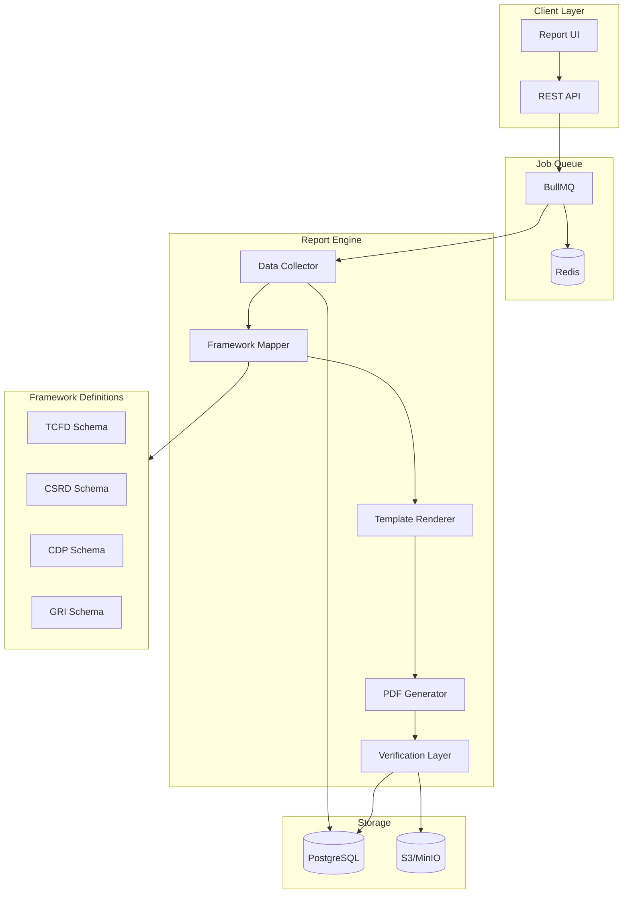

# Scalable Reporting Engine

## Architecture Overview



---

## 1. Database Schema Extensions

Extend [web/prisma/schema.prisma](web/prisma/schema.prisma) with new models:

### ReportFramework

Stores framework metadata and versioning:

- `id`, `code` (tcfd, csrd, cdp, gri), `name`, `version`
- `schemaPath` - path to JSON schema defining required disclosures
- `isActive`, `effectiveDate`

### ReportTemplate

Stores template definitions:

- `id`, `frameworkId`, `name`, `version`
- `templatePath` - path to React template component
- `sections` (JSON) - ordered list of section definitions
- `branding` (JSON) - default styles, logo placement

### ReportJob

Tracks async generation:

- `id`, `reportId`, `status` (queued, processing, completed, failed)
- `progress` (0-100), `currentStep`, `errorMessage`
- `startedAt`, `completedAt`, `workerId`

### Report Model Enhancements

Add to existing Report model:

- `frameworkId`, `templateId` - link to framework/template
- `contentHash` - SHA-256 of generated content
- `verificationCode` - short code for public lookup
- `publicUrl` - shareable verification link
- `artifacts` (JSON) - paths to all generated files (PDF, HTML, JSON, CSV)

---

## 2. Framework Definition System

Create `web/lib/reporting/frameworks/` directory:

### Framework Schema Structure

Each framework gets a JSON schema file defining:

```typescript
interface FrameworkSchema {
  code: string;           // "tcfd"
  version: string;        // "2023"
  disclosures: Disclosure[];
}

interface Disclosure {
  id: string;             // "governance-a"
  category: string;       // "Governance"
  requirement: string;    // "Board oversight of climate risks"
  dataMapping: DataMapping;
  required: boolean;
}

interface DataMapping {
  source: 'emissions' | 'activity' | 'organization' | 'computed';
  query?: string;         // How to extract from OpenEco data
  computation?: string;   // Formula for computed fields
}
```

### Initial Frameworks

- `tcfd.json` - Task Force on Climate-related Financial Disclosures
- `csrd.json` - Corporate Sustainability Reporting Directive (EU)
- `cdp.json` - Carbon Disclosure Project
- `gri.json` - Global Reporting Initiative (GRI 305)

---

## 3. Data Collection Layer

Create `web/lib/reporting/collectors/`:

### ReportDataCollector

Gathers all data needed for a report:

- `collectEmissions(orgId, periodStart, periodEnd)` - aggregated by scope/category
- `collectActivityData(orgId, periodStart, periodEnd)` - with evidence status
- `collectOrganizationProfile(orgId)` - boundaries, facilities, metadata
- `collectMethodology()` - factors used, GWP sets, calculation versions

Output: `ReportDataBundle` - normalized data structure ready for mapping.

---

## 4. Framework Mapping Layer

Create `web/lib/reporting/mappers/`:

### FrameworkMapper

Maps OpenEco data to framework-specific disclosures:

```typescript
class FrameworkMapper {
  constructor(schema: FrameworkSchema) {}
  
  map(data: ReportDataBundle): MappedReport {
    // For each disclosure in schema:
    // - Extract relevant data from bundle
    // - Apply computations
    // - Flag missing/incomplete data
    return {
      framework: this.schema.code,
      disclosures: [...],
      completeness: { filled: 12, total: 15, percent: 80 },
      warnings: [...]
    };
  }
}
```

---

## 5. Template Rendering System

Create `web/lib/reporting/templates/`:

### Template Components (React)

- `ReportShell.tsx` - outer wrapper, header/footer, page numbers
- `CoverPage.tsx` - title, org logo, period, framework badge
- `TableOfContents.tsx` - auto-generated from sections
- `ScopeBreakdown.tsx` - pie chart + table for Scope 1/2/3
- `EmissionsTrend.tsx` - year-over-year line chart
- `DisclosureSection.tsx` - renders a single framework disclosure
- `MethodologyAppendix.tsx` - factors, sources, calculation notes
- `VerificationFooter.tsx` - hash, QR code, verification URL

### HTML Renderer

```typescript
async function renderReportHTML(
  mappedReport: MappedReport,
  template: ReportTemplate,
  branding: BrandingConfig
): Promise<string> {
  // Server-side render React components to HTML string
  // Include Tailwind CSS inline for PDF compatibility
}
```

---

## 6. PDF Generation Service

Create `web/lib/reporting/pdf/`:

### PlaywrightPDFGenerator

```typescript
class PlaywrightPDFGenerator {
  async generate(html: string, options: PDFOptions): Promise<Buffer> {
    const browser = await playwright.chromium.launch();
    const page = await browser.newPage();
    await page.setContent(html, { waitUntil: 'networkidle' });
    const pdf = await page.pdf({
      format: 'A4',
      printBackground: true,
      margin: { top: '1cm', bottom: '1cm', left: '1cm', right: '1cm' }
    });
    await browser.close();
    return pdf;
  }
}
```

---

## 7. Job Queue System

### Redis + BullMQ Setup

- Add Redis to `deploy/compose.dev.yml`
- Create `web/lib/reporting/queue/`:
    - `reportQueue.ts` - queue definition
    - `reportWorker.ts` - job processor

### Job Flow

```typescript
// API creates job
const job = await reportQueue.add('generate', {
  reportId: report.id,
  organizationId: org.id,
  frameworkCode: 'tcfd',
  periodStart,
  periodEnd,
});

// Worker processes
reportWorker.process('generate', async (job) => {
  await updateProgress(job, 10, 'Collecting data...');
  const data = await collector.collect(...);
  
  await updateProgress(job, 30, 'Mapping to framework...');
  const mapped = await mapper.map(data);
  
  await updateProgress(job, 50, 'Rendering template...');
  const html = await renderer.render(mapped);
  
  await updateProgress(job, 70, 'Generating PDF...');
  const pdf = await pdfGenerator.generate(html);
  
  await updateProgress(job, 90, 'Uploading artifacts...');
  const urls = await storage.upload([
    { name: 'report.pdf', buffer: pdf },
    { name: 'report.html', buffer: html },
    { name: 'data.json', buffer: JSON.stringify(mapped) },
  ]);
  
  await updateProgress(job, 100, 'Complete');
  return urls;
});
```

---

## 8. Verification Layer

Create `web/lib/reporting/verification/`:

### Content Hashing

- SHA-256 hash of final PDF content
- Store hash in Report record
- Hash is immutable proof of content

### Verification Code

- Generate short alphanumeric code (e.g., `OE-2024-A7X9`)
- Globally unique, easy to type/share

### QR Code Generation

- Embed verification URL in QR code
- Include in PDF footer
- Use `qrcode` npm package

### Public Verification Endpoint

`GET /api/verify/[code]` returns:

- Organization name, report title, period
- Content hash
- Generation timestamp
- "Verified" badge if hash matches

---

## 9. Storage Layer

Create `web/lib/reporting/storage/`:

### S3-Compatible Storage

- Use MinIO for local development
- Production: AWS S3, Cloudflare R2, or any S3-compatible
- Store: PDFs, HTML exports, JSON data exports, CSV exports

### File Organization

```
/reports/{orgId}/{reportId}/
  - report.pdf
  - report.html
  - data.json
  - activity-data.csv
  - emissions.csv
  - methodology.md
```

---

## 10. API Endpoints

Extend `web/app/api/reports/`:

### POST /api/reports

Create report and queue generation job

### GET /api/reports/[id]

Get report with job status

### GET /api/reports/[id]/status

Get generation progress (polling endpoint)

### GET /api/reports/[id]/download/[format]

Download specific format (pdf, html, json, csv)

### GET /api/verify/[code]

Public verification endpoint

---

## 11. UI Components

Create `web/components/reports/`:

- `ReportBuilder.tsx` - wizard for creating new reports
- `FrameworkSelector.tsx` - choose framework, see required disclosures
- `ReportProgress.tsx` - real-time progress during generation
- `ReportCard.tsx` - display report in list with status
- `ReportViewer.tsx` - preview HTML version in-app
- `VerificationBadge.tsx` - shows hash + QR code

---

## File Structure Summary

```
web/
├── lib/
│   └── reporting/
│       ├── index.ts              # Public exports
│       ├── types.ts              # Shared types
│       ├── frameworks/
│       │   ├── index.ts
│       │   ├── tcfd.json
│       │   ├── csrd.json
│       │   ├── cdp.json
│       │   └── gri.json
│       ├── collectors/
│       │   └── ReportDataCollector.ts
│       ├── mappers/
│       │   └── FrameworkMapper.ts
│       ├── templates/
│       │   ├── components/
│       │   │   ├── ReportShell.tsx
│       │   │   ├── CoverPage.tsx
│       │   │   └── ...
│       │   └── HTMLRenderer.ts
│       ├── pdf/
│       │   └── PlaywrightPDFGenerator.ts
│       ├── queue/
│       │   ├── reportQueue.ts
│       │   └── reportWorker.ts
│       ├── verification/
│       │   ├── hash.ts
│       │   ├── qrcode.ts
│       │   └── verificationCode.ts
│       └── storage/
│           └── S3Storage.ts
├── app/
│   └── api/
│       └── reports/
│           ├── route.ts
│           ├── [id]/
│           │   ├── route.ts
│           │   ├── status/route.ts
│           │   └── download/[format]/route.ts
│       └── verify/
│           └── [code]/route.ts
├── components/
│   └── reports/
│       ├── ReportBuilder.tsx
│       ├── FrameworkSelector.tsx
│       ├── ReportProgress.tsx
│       └── ...
└── prisma/
    └── schema.prisma  # Extended with new models
```

---

## Dependencies to Add

```json
{
  "bullmq": "^5.0.0",
  "ioredis": "^5.3.0",
  "playwright": "^1.40.0",
  "qrcode": "^1.5.3",
  "@aws-sdk/client-s3": "^3.0.0"
}
```

---

## Implementation Order

1. Schema extensions + migrations
2. Framework definitions (start with TCFD)
3. Data collector
4. Framework mapper
5. Template components
6. HTML renderer
7. Redis + BullMQ setup
8. PDF generator
9. Storage layer
10. Verification layer
11. API endpoints
12. UI components